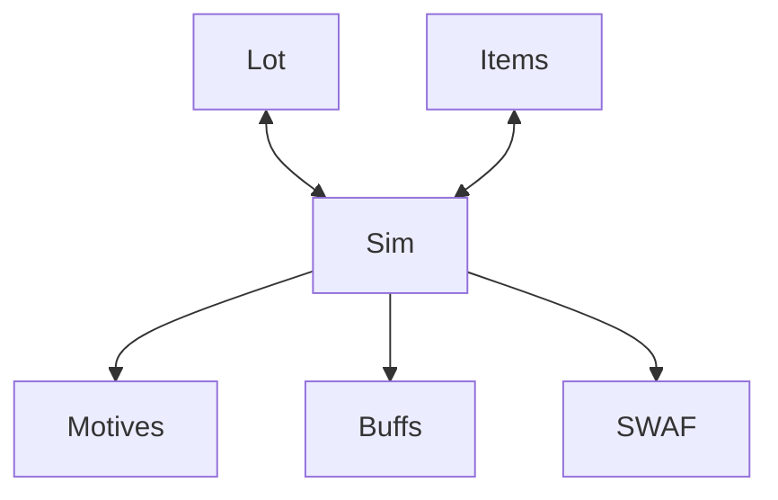

# Motives Engine

Motive Engine provides the framework for creating characters with needs, aspirations, and interacting with simulated world.

## 📝 Goals

- [ ] Motives
- [ ] Items
- [ ] Aspirations (SWAF)
- [x] Buffs
- [ ] Sim
- [ ] Lot

## 🧱 Architecture




## 📦 Installation

```swift
let package = Package(
    // name, platforms, products, etc.
    dependencies: [
        // other dependencies
        .package(url: "https://github.com/tonytins/motive-engine.git", branche: "main"),
    ],
    targets: [
        .executableTarget(name: "<your-game>", dependencies: [
            // other dependencies
            .product(name: "MotiveEngine", package: "motive-engine"),
        ]),
        // other targets
    ]
)
```

Or in Xcode: File -> Add Package Dependencies, then paste the repo URL.

## ✅ Supported Versions

| swift-cst    | Minimum Swift Version |
| ------- | --------------------- |
| ``main`` | 6.3                   |

## ⚖️ License

I license this project under BSD-3-Clause license — see the [LICENSE](LICENSE) file for full text.
